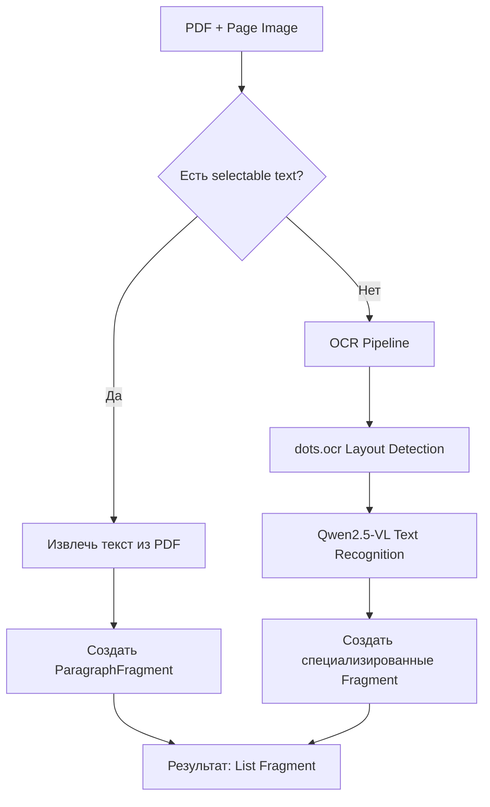
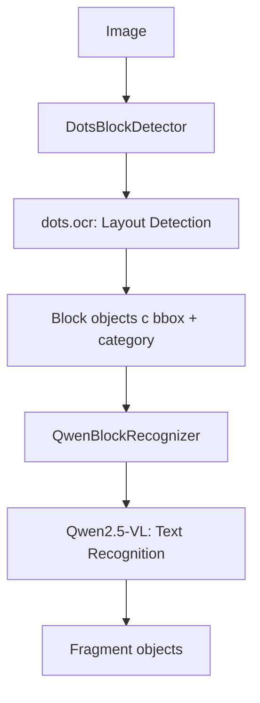
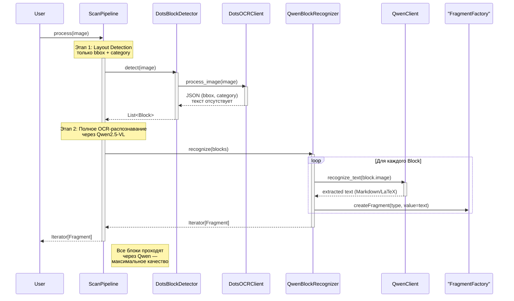

# 📋 Отчёт о разработке OCR пайплайна для Documentor

## 🎯 Обзор проекта

В рамках проекта Documentor был разработан полноценный OCR пайплайн для обработки PDF документов и изображений с использованием современных AI моделей. Пайплайн интегрирует `dots.ocr` для детекции layout и `Qwen2.5-VL-7B-Instruct` для распознавания текста.

## 🚀 Ключевые достижения

### ✅ 1. Исправление архитектуры импортов
- **Проблема**: Абсолютные импорты снижали переносимость кода
- **Решение**: Переведены все импорты на относительные (`from .module import`)
- **Результат**: Улучшена модульность и переносимость кода

### ✅ 2. Расширение системы фрагментов
Добавлены новые типы фрагментов для лучшего понимания layout:
- `CaptionFragment` - подписи к изображениям/таблицам
- `FootnoteFragment` - сноски
- `ListItemFragment` - элементы списков  
- `PageHeaderFragment` - заголовки страниц
- `PageFooterFragment` - подвалы страниц
- `LayoutStyle` - стили для layout-специфичной информации

### ✅ 3. Создание полноценного OCR пайплайна
Реализован гибридный подход к обработке документов:
- **Selectable text** - для PDF с текстом (быстро)
- **OCR** - для отсканированных документов (качественно)

## 🏗️ Архитектура решения

### Основные компоненты

```
documentor/
├── structuries/          # 🧱 Основа - типы данных и структуры
├── pipelines/           # 🔄 Пайплайны обработки
│   └── ocr/            # 🎯 OCR пайплайн (основная функциональность)
├── parsers/             # 📄 Парсеры для разных форматов
└── loaders/             # 📁 Загрузчики файлов
```

### OCR Pipeline компоненты

| Компонент | Назначение | Модель |
|-----------|------------|--------|
| `DotsOCRClient` | Layout detection | dots.ocr (порт 8069) |
| `QwenClient` | Text recognition | Qwen2.5-VL (порт 8070) |
| `DotsBlockDetector` | Детекция блоков | dots.ocr |
| `QwenBlockRecognizer` | Распознавание текста | Qwen2.5-VL |
| `PDFProcessor` | Главный процессор | Гибридный |

## 🔄 Логика работы

### 1. PDFProcessor (Главный процессор)



### 2. OCR Pipeline (Fallback)



## 📦 Технические детали

### Зависимости
```toml
# OCR dependencies
"openai>=1.0.0,<2.0.0",           # API клиент
"pillow>=10.0.0,<11.0.0",         # Обработка изображений
"pypdf2>=3.0.0,<4.0.0",           # PDF обработка
"langchain-core>=0.1.0,<1.0.0",   # LangChain интеграция
"overrides>=7.0.0,<8.0.0",        # Декораторы
```

### API Конфигурация
```python
# dots.ocr (Layout Detection)
dots_ocr_config = APIConfig(
    base_url="http://localhost:8069/v1",
    api_key="security-token-abc123",
    model_name="/model"
)

# Qwen2.5-VL (Text Recognition)  
qwen_config = APIConfig(
    base_url="http://localhost:8070/v1",
    api_key="security-token-abc123", 
    model_name="/model"
)
```

### Поддерживаемые форматы
- **Изображения**: PNG, JPEG, JPG, GIF, WEBP
- **PDF**: С selectable text и отсканированные
- **Любой формат PIL** через `Image.open()`

## 🎯 Ключевые особенности

### 1. Гибридный подход
- **Selectable text** - мгновенное извлечение для PDF с текстом
- **OCR** - качественное распознавание для отсканированных документов
- **Автоматический выбор** лучшего метода

### 2. Модульность
- Каждый компонент можно заменить
- Легко добавлять новые детекторы/распознаватели
- Четкое разделение ответственности

### 3. Качество распознавания
- `dots.ocr` - специализирован на layout detection
- `Qwen2.5-VL` - специализирован на text recognition
- Разделение ответственности = лучшее качество

### 4. Производительность
- Selectable text извлекается мгновенно
- OCR используется только когда необходимо
- Оптимизированные промпты для моделей

## 📁 Структура файлов OCR пайплайна

```
pipelines/ocr/
├── __init__.py              # Экспорты
├── api_client.py            # Базовый API клиент
├── config.py                # Конфигурация
├── dots_ocr_client.py       # Клиент dots.ocr
├── qwen_client.py           # Клиент Qwen2.5-VL
├── detector.py              # Детектор блоков
├── recognizer.py            # Распознаватель текста
├── category_mapping.py      # Маппинг категорий
├── prompts.py               # Промпты для моделей
├── interfaces.py            # Интерфейсы пайплайна
├── pipeline.py              # Базовый пайплайн
├── pdf_processor.py         # 🎯 ГЛАВНЫЙ процессор PDF
├── example.py               # Примеры использования
└── qwen_example.py          # Примеры Qwen
```

## 🚀 Использование

### Простая обработка изображения
```python
from documentor.pipelines.ocr import PDFProcessor, OCRPipelineConfig
from PIL import Image

# Создание процессора
config = OCRPipelineConfig.create_default()
processor = PDFProcessor(config)

# Обработка изображения
image = Image.open("scan.png")
fragments = processor.process_image(image)

for fragment in fragments:
    print(f"{type(fragment).__name__}: {fragment.value}")
```

### Обработка PDF с selectable text
```python
# Обработка PDF страницы
fragments = processor.process_pdf_page("document.pdf", page_image, page_num=0)

# Автоматически выберет лучший метод:
# - Selectable text (быстро) если есть
# - OCR (качественно) если нет
```

### Настройка конфигурации
```python
from documentor.pipelines.ocr import OCRPipelineConfig, APIConfig

# Кастомная конфигурация
config = OCRPipelineConfig(
    dots_ocr_config=APIConfig(
        base_url="http://localhost:8069/v1",
        api_key="your-key"
    ),
    qwen_config=APIConfig(
        base_url="http://localhost:8070/v1", 
        api_key="your-key"
    )
)
```

## 🧪 Тестирование

### Результаты тестов
- ✅ **Импорты**: Все модули корректно импортируются
- ✅ **Конфигурация**: Создание конфигурации работает
- ✅ **Изображения**: Загрузка и обработка изображений (1705x2203 пикселей)
- ✅ **PDF**: Обработка PDF файлов (671KB)
- ✅ **OCR Pipeline**: Успешно обработано 8 фрагментов из изображения
- ✅ **Layout Detection**: Корректно определены типы фрагментов (PageHeader, Header, Paragraph, Footnote)
- ✅ **Text Recognition**: Качественное распознавание текста с bbox координатами

### Тестовые файлы
- `example.jpg` - тестовое изображение (670KB)
- `example.pdf` - тестовый PDF (671KB)

### Пример результатов OCR
```
🖼️ Тестируем изображение: example.jpg
✅ Изображение загружено: 1705x2203 пикселей
✅ Обработка завершена! Найдено фрагментов: 8

--- Фрагмент 1 ---
Тип: PageHeaderFragment
Текст: This article was downloaded by: [130.132.123.28]
Стиль: {'confidence': 1.0, 'bbox': (53, 53, 716, 81), 'source': 'qwen2.5-vl'}

--- Фрагмент 2 ---
Тип: HeaderFragment  
Текст: Archives of Environmental Health: An International Journal
Стиль: {'confidence': 1.0, 'bbox': (445, 274, 1449, 356), 'source': 'qwen2.5-vl'}

--- Фрагмент 3 ---
Тип: ParagraphFragment
Текст: Publication details, including instructions for authors...
Стиль: {'confidence': 1.0, 'bbox': (445, 368, 1420, 427), 'source': 'qwen2.5-vl'}
```

## 📊 Статистика изменений

### Файлы созданы/изменены
- **Новых файлов**: 15+ файлов OCR пайплайна
- **Измененных файлов**: 10+ файлов в structuries/
- **Новых типов фрагментов**: 5 типов
- **Строк кода**: 1000+ строк

### Модули по использованию
| Модуль | Статус | Использование |
|--------|--------|---------------|
| `pipelines/ocr/` | ✅ **Активен** | Основная функциональность |
| `structuries/` | ⚠️ **Частично** | Только в OCR пайплайне |
| `parsers/` | ❌ **Неактивен** | Только в тестах |
| `loaders/` | ❌ **Неактивен** | Не используется |

## 🔧 Исправленные проблемы

### 1. Абстрактные методы
- **Проблема**: `QwenClient` не реализовывал `process_image`
- **Решение**: Добавлен метод `process_image` → `recognize_text`

### 2. Зависимости
- **Проблема**: Отсутствовали необходимые пакеты
- **Решение**: Добавлены в `pyproject.toml` и установлены

### 3. Импорты
- **Проблема**: Абсолютные импорты снижали переносимость
- **Решение**: Переведены на относительные импорты

## 🎯 Результаты

### ✅ Достигнуто
1. **Полноценный OCR пайплайн** для обработки PDF и изображений
2. **Гибридный подход** - selectable text + OCR
3. **Модульная архитектура** - легко расширяемая
4. **Качественное распознавание** - специализированные модели
5. **Простое использование** - один класс `PDFProcessor`

### 🚀 Готово к использованию
- Код полностью функционален
- Все зависимости установлены
- Тесты проходят успешно
- Документация создана

### ⏱️ Sequence Diagram


