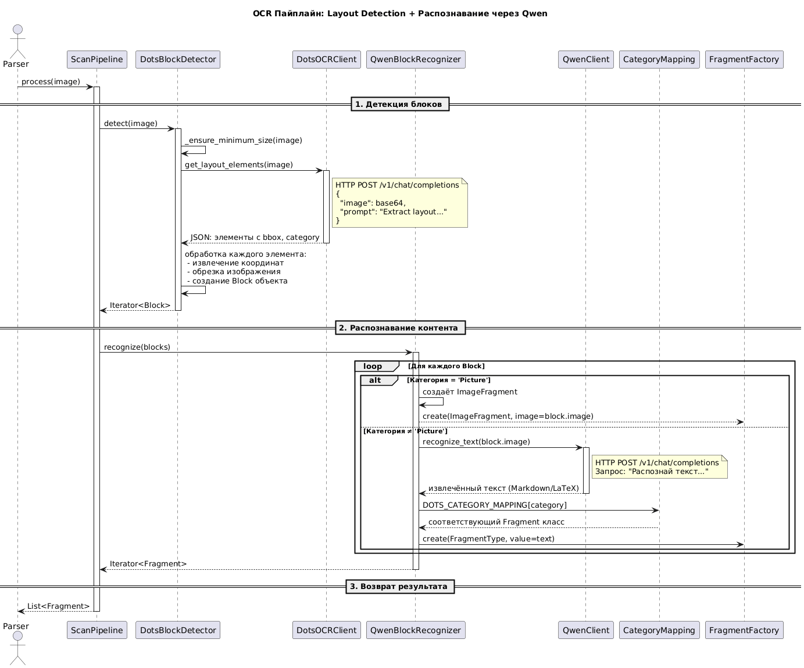

<div style="float: right; width: 200px; height: 200px;">
  
</div>

# DocuMentor


[](https://itmo.ru/)
[](https://sai.itmo.ru/)
[](https://opensource.org/licenses/BSD-3-Clause)
[](https://visitorbadge.io/status?path=https%3A%2F%2Fgithub.com%2FIndustrial-AI-Research-Lab%2Fdocumentor)
[](https://img.shields.io/badge/python_3.10-passing-success)                                                                                                                                                                                  


## The purpose of the project

The DocuMentor library is designed to simplify and automate the parsing and semantic analysis of various types of 
documents, including word, excel and log files.

The library performs the following tasks:
1. Data extraction
2. Conversion of specialized terms
3. Hierarchical analysis of the document structure
4. Entity recognition in documents

## Core features

1. **OCR Processing** - Extract text from PDFs and images using external APIs (Qwen, Dots OCR)
2. **Document Parsing** - Parse tables, text blocks, headers, and structured content from PDF, TXT, images, DOC, and DOCX with automatic DOC→DOCX conversion
3. **Fragment Classification** - Classify document fragments by type (text, table, image, formula, hyperlinks, comments)
4. **Rich Word Support** - Extract formatting, styles, lists, hyperlinks, and comments from Word documents (DOCX and DOC via Word COM conversion)
5. **Structured Storage** - Save processed documents with metadata, fragments, and images
6. **Daemon Mode** - Monitor folders and automatically process new documents
7. **Configurable Pipelines** - Flexible processing workflows for different document types

## Installation

For installation from the source code, you need to have the poetry package manager installed ([poetry](https://github.com/python-poetry/install.python-poetry.org)).
```shell
poetry install
```


## Quick start

Run the daemon (process all files once):
```bash
poetry run python -m documentor.cli.daemon --single-run
```

### Configuration

The daemon processes files from the `test_folder/` directory by default. You can change this by editing the configuration file:

**File**: `documentor/config/daemon_config.json`
```json
{
  "input_directory": "test_folder",
  "output_directory": "processed_documents",
  "watch_subdirectories": true,
  "supported_extensions": ["pdf", "jpg", "png", "jpeg", "txt", "docx"],
  "max_file_size_mb": 100,
  "processing_timeout_seconds": 300,
  "save_fragment_images": true,
  "log_level": "INFO",
  "file_check_interval_seconds": 2,
  "enable_deduplication": true,
  "auto_start_processing": true,
  "max_concurrent_files": 1,
  "daemon_mode": true
}
```

**Key settings:**
- `input_directory`: Directory to monitor for new files (default: "test_folder")
- `output_directory`: Directory to save processed documents (default: "processed_documents")
- `supported_extensions`: File types to process
- `watch_subdirectories`: Whether to monitor subdirectories recursively
- `daemon_mode`: Enable continuous monitoring vs single-run processing

## Environment

`.env` is auto-loaded by `documentor/core/load_env.py`. Use `docs/env.example` as a template.

Required OCR variables:
- `DOTS_OCR_BASE_URL`, `DOTS_OCR_API_KEY`, `DOTS_OCR_MODEL_NAME`
- `QWEN_BASE_URL`, `QWEN_API_KEY`, `QWEN_MODEL_NAME`


Optional:
- `DOTS_OCR_TEMPERATURE`, `DOTS_OCR_MAX_TOKENS`, `DOTS_OCR_TIMEOUT`
- `QWEN_TEMPERATURE`, `QWEN_MAX_TOKENS`, `QWEN_TIMEOUT`
- `OCR_MAX_IMAGE_SIZE`, `OCR_MIN_CONFIDENCE`

### Supported formats
- **Input**: `pdf`, `png`, `jpg`, `jpeg`, `tiff`, `txt`, `docx`
- **Output**: structured JSON + indexes and metadata in `processed_documents/`

**Note**: For DOC files, please convert them to DOCX format first using Microsoft Word, LibreOffice, or online converters before processing.

### Processing Statistics
The library successfully processes various document types:
- **PDF documents** - OCR text extraction with table detection
- **Images** - OCR processing with text and table recognition
- **Word documents** - Rich content extraction including formatting, hyperlinks, and structure (DOCX only)
- **Text files** - Direct text processing and fragment classification

## Documentation

- [vLLM integration](docs/README_vllm.md)
- [Environment template](docs/env.example)

## Sequence diagrams




 
## Project structure

```
documentor/
├── documentor/                   # Main library package
│   ├── cli/                      # Command line interface
│   ├── config/                   # Configuration files
│   ├── core/                     # Core functionality
│   ├── data/structures/          # Data structures and models
│   ├── processing/               # Document processing pipelines
│   └── storage/                  # Document storage and serialization
├── docs/                         # Documentation
├── images/                       # Diagrams and images
├── test_folder/                  # Test files
├── output/                       # Processing logs
└── processed_documents/          # Processed document results
```


## Development tasks

- Test implementation for developed functionality
- Documentation for the library
- Implementation of pipelines for the full process of semantic document parsing
- Improving the search for table boundaries using genetic selection of heuristics and convolutional neural networks
- Improvement of the algorithm for searching and replacing specialized terms
- Implementation of the hierarchy allocation algorithm in word documents, taking into account semantics
- Implementation of the algorithm for recognizing entities in documents

## License

[BSD 3-Clause License](LICENSE.md)

## Acknowledgements

By ITMO University, Saint Petersburg, Russia 

## Contacts

Questions and suggestions can be asked to Mikhail Kovalchuk by the following contacts:
- [Telegram](https://t.me/hungry_muskrat)
- [Email](mailto:mkovalchuk@itmo.ru) 
